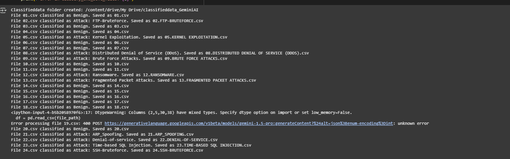
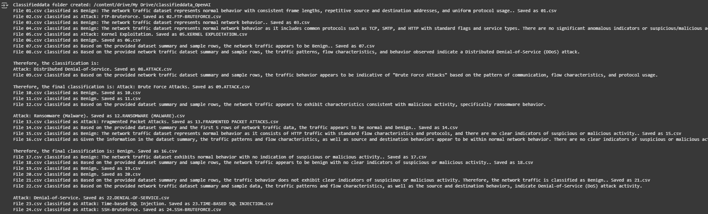
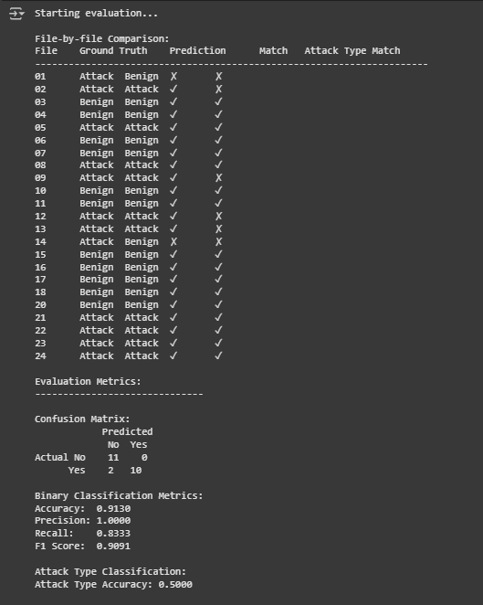
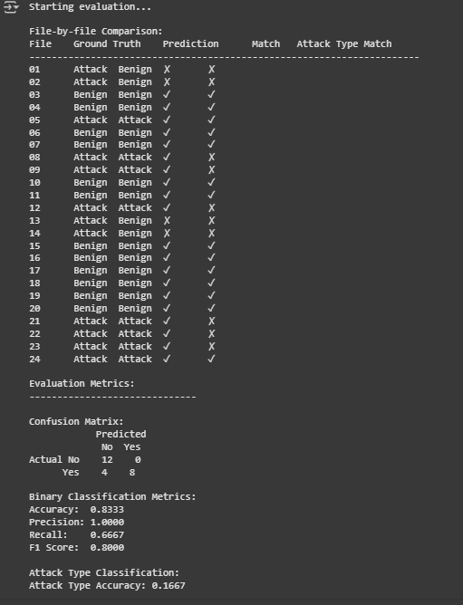
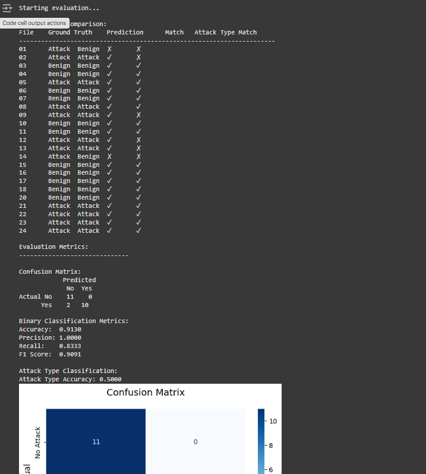
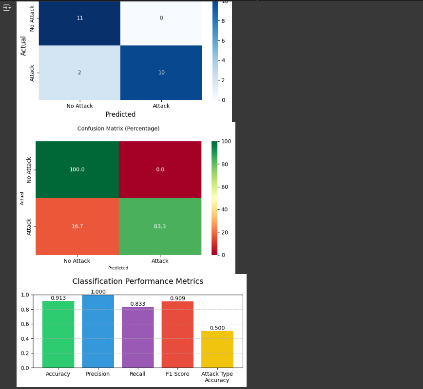
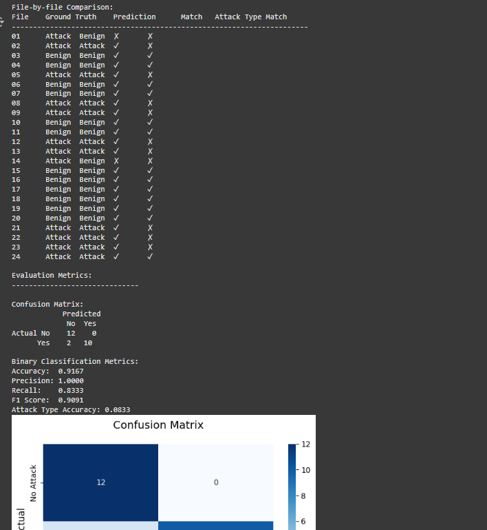
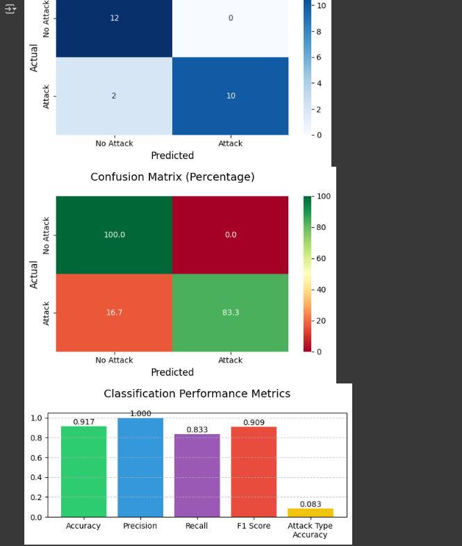

# Detecting Cyber Attacks in Network Logs Using Large Language Models
🚀 Cyber Threat Detection using Large Language Models (LLMs)
This project investigates how Large Language Models (LLMs), including GPT-4 and LLaMA2, can be utilized to enhance the accuracy and speed of detecting cybersecurity threats. Traditional Intrusion Detection Systems (IDS) often fail against complex threats like DDoS, SQL Injection, and Ransomware. Our solution leverages prompt engineering techniques with real-world network traffic data to build a proactive AI-based security layer.


Datasets include labeled traffic samples with attack and non-attack instances. We evaluate model output using precision, recall, and accuracy metrics, visualized using graphs and plots. The findings show that LLMs can offer superior threat detection and interpretability compared to traditional methods.

### <h2 style="font-size: 1.5em; font-weight: 700; color: #2e86c1;">📁 Dataset</h2>

Sources: Real-world traffic datasets as referenced in:

De Jesus Coelho & Westphall (2024)

Ferrag et al. (2024)

Types of threats detected:

Distributed Denial of Service (DDoS)

SQL Injection

Ransomware

Other complex attacks

Here is Datasets link for both OpenAI and Gemini https://drive.google.com/drive/folders/1unaf_mw7BHYIj0EBPFwXoNsV9PFOqTgY?usp=sharing  

### <h2 style="font-size: 1.5em; font-weight: 700; color: #2e86c1;">Below is code only For Gemini. If you want to open AI, you see the files.</h2>

✅ Steps Followed in the Project


### <h2 style="font-size: 1.5em; font-weight: 700; color: #2e86c1;">🔹 Step 1: Import Required Libraries</h2>
```python


import os, pandas as pd, time; from google.colab import drive; import google.generativeai as genai
```


### <h2 style="font-size: 1.5em; font-weight: 700; color: #2e86c1;">🔹 Step 2: Mount Google Drive </h2>

```python

from google.colab import drive
drive.mount('/content/drive')

# Define input folder path
INPUT_FOLDER = "/content/drive/My Drive/mixed"

# Verify input folder
if not os.path.exists(INPUT_FOLDER):
    print(f"Error: Input folder does not exist at {INPUT_FOLDER}")
else:
    print(f"Input folder verified: {INPUT_FOLDER}")
```


### <h2 style="font-size: 1.5em; font-weight: 700; color: #2e86c1;">🔹 Step 3: Connect to LLM API using API Key</h2>

```python


API_KEY = "Replace with your API KEY here"

genai.configure(api_key=API_KEY)

try:
    # Test connection with a simple chat prompt
    model = genai.GenerativeModel('gemini-1.5-pro')
    response = model.generate_content("Hello, LLM! Can you respond?")
    print(f"LLM Response: {response.text.strip()}")
except Exception as e:
    print(f"Error connecting to LLM: {e}")
```

### <h2 style="font-size: 1.5em; font-weight: 700; color: #2e86c1;">🔹 Step 4: Give LLM Access to Data and Perform Basic Operations</h2>
Loop through dataset rows and feed traffic logs to the LLM.

```python

def test_llm_with_data(model):
    # Load a sample dataset
    sample_file = os.path.join(INPUT_FOLDER, os.listdir(INPUT_FOLDER)[0])
    df = pd.read_csv(sample_file, nrows=5)
    print("Sample Data (First 5 rows):")
    print(df)

    # Ask LLM to describe the dataset
    prompt = f"Analyze the following dataset:\n{df.to_string()}\nWhat can you infer?"
    response = model.generate_content(prompt).text
    print("LLM Analysis Response:", response)

if model:
    test_llm_with_data(model)

```

### <h2 style="font-size: 1.5em; font-weight: 700; color: #2e86c1;">🔹 Step 5: Classify Files </h2>
Each row of the dataset is classified into Attack or Non-Attack.

Store the results in a structured format (.csv or DataFrame).

```python

OUTPUT_FOLDER = "/content/drive/My Drive/classifieddata_GeminiAI"

# Create classifieddata folder here
os.makedirs(OUTPUT_FOLDER, exist_ok=True)
print(f"Classifieddata folder created: {OUTPUT_FOLDER}")

# Function to classify files and save serially
def classify_and_save_files():
    # Make sure necessary imports are available
    import os
    import pandas as pd

    csv_files = sorted([f for f in os.listdir(INPUT_FOLDER) if f.endswith('.csv')])

    for filename in csv_files:
        file_path = os.path.join(INPUT_FOLDER, filename)
        df = pd.read_csv(file_path)

        # Modified prompt to be more generic and focused on network behavior
        prompt = f"""Analyze this network traffic dataset and determine if it represents normal network behavior or if there's any suspicious/malicious activity. If malicious, specify the type of attack pattern you observe.

        Consider these key aspects in your analysis:
        - Traffic patterns and flow characteristics
        - Source and destination behaviors
        - Protocol usage and patterns
        - Any anomalous indicators

        Dataset:
        {df.to_string()}

        Provide only your final classification as a single line response starting with either "Attack:" (followed by the specific type) or "Benign".
        """

        try:
            # Generate response using Gemini
            response = model.generate_content(prompt)

            # Extract the result from Gemini's response
            result = response.text.strip()

            # Process the result to determine the new filename
            if "Attack:" in result:
                # If an attack is detected
                attack_type = result.split(":")[1].strip().upper()
                base_name, ext = os.path.splitext(filename)
                new_filename = f"{base_name}.{attack_type}{ext}"
            else:
                # If no attack (Benign) is detected, keep the filename unchanged
                new_filename = filename

            # Save the file with the new serial name (or original name if no attack)
            new_path = os.path.join(OUTPUT_FOLDER, new_filename)
            df.to_csv(new_path, index=False)
            print(f"File {filename} classified as {result}. Saved as {new_filename}")

        except Exception as e:
            print(f"Error processing file {filename}: {e}")

# Call the function
try:
    classify_and_save_files()
except Exception as e:
    print(f"Error in classify_and_save_files: {e}")
```
Genimi 

OpenAPI

    
### <h2 style="font-size: 1.5em; font-weight: 700; color: #2e86c1;">🔹 Step 6: Evaluate Results </h2>
Evaluate results using traditional metrics:

Precision

Recall

F1 Score

Accuracy

Compare the performance of LLM models vs traditional methods.

```python


import os
import pandas as pd
from sklearn.metrics import confusion_matrix, accuracy_score, precision_score, recall_score, f1_score

# Define paths - Update these paths according to your directory structure
GROUND_TRUTH_FOLDER = "/content/drive/My Drive/Ground"
OUTPUT_FOLDER = "/content/drive/My Drive/classifieddata_GeminiAI"

def get_attack_type_from_filename(filename):
    """Extract attack type from filename if present"""
    parts = filename.split('.')
    if len(parts) > 2:
        return parts[1].lower()
    return None

def evaluate_classification():
    print("Starting evaluation...")
    try:
        # Get ground truth from filenames
        ground_truth = {}
        for filename in os.listdir(GROUND_TRUTH_FOLDER):
            if filename.endswith('.csv'):
                file_number = filename.split('.')[0]  # Get the number part
                attack_type = get_attack_type_from_filename(filename)
                ground_truth[file_number] = {
                    'is_attack': attack_type is not None,
                    'attack_type': attack_type
                }

        # Get predictions
        predictions = {}
        for filename in os.listdir(OUTPUT_FOLDER):
            if filename.endswith('.csv'):
                file_number = filename.split('.')[0]  # Get the number part
                attack_type = get_attack_type_from_filename(filename)
                predictions[file_number] = {
                    'is_attack': attack_type is not None,
                    'attack_type': attack_type
                }

        # Prepare labels for metrics calculation
        true_labels = []
        pred_labels = []
        type_matches = 0
        total_attacks = 0

        # Print detailed comparison
        print("\nFile-by-file Comparison:")
        print("File\tGround Truth\tPrediction\tMatch\tAttack Type Match")
        print("-" * 70)

        for file_number in sorted(ground_truth.keys()):
            if file_number in predictions:
                true_val = ground_truth[file_number]['is_attack']
                pred_val = predictions[file_number]['is_attack']
                true_type = ground_truth[file_number]['attack_type']
                pred_type = predictions[file_number]['attack_type']

                true_labels.append(1 if true_val else 0)
                pred_labels.append(1 if pred_val else 0)

                match = "✓" if true_val == pred_val else "✗"
                type_match = "✓" if true_type == pred_type else "✗"

                if true_val:
                    total_attacks += 1
                    if true_type == pred_type:
                        type_matches += 1

                print(f"{file_number}\t{'Attack' if true_val else 'Benign'}\t"
                      f"{'Attack' if pred_val else 'Benign'}\t{match}\t{type_match}")

        # Calculate metrics
        conf_matrix = confusion_matrix(true_labels, pred_labels)
        accuracy = accuracy_score(true_labels, pred_labels)
        precision = precision_score(true_labels, pred_labels)
        recall = recall_score(true_labels, pred_labels)
        f1 = f1_score(true_labels, pred_labels)
        attack_type_accuracy = type_matches / total_attacks if total_attacks > 0 else 0

        # Print evaluation metrics
        print("\nEvaluation Metrics:")
        print("-" * 30)
        print("\nConfusion Matrix:")
        print("            Predicted")
        print("             No  Yes")
        print("Actual No   {:3d}  {:3d}".format(conf_matrix[0][0], conf_matrix[0][1]))
        print("      Yes  {:3d}  {:3d}".format(conf_matrix[1][0], conf_matrix[1][1]))

        print("\nBinary Classification Metrics:")
        print(f"Accuracy:  {accuracy:.4f}")
        print(f"Precision: {precision:.4f}")
        print(f"Recall:    {recall:.4f}")
        print(f"F1 Score:  {f1:.4f}")

        print("\nAttack Type Classification:")
        print(f"Attack Type Accuracy: {attack_type_accuracy:.4f}")

        return {
            'confusion_matrix': conf_matrix,
            'accuracy': accuracy,
            'precision': precision,
            'recall': recall,
            'f1_score': f1,
            'attack_type_accuracy': attack_type_accuracy
        }

    except Exception as e:
        print(f"Evaluation error: {e}")
        import traceback
        print(traceback.format_exc())
        return None

# Execute the evaluation
if __name__ == "__main__":
    metrics = evaluate_classification()
```
Genimi 



OpenAPI



### <h2 style="font-size: 1.5em; font-weight: 700; color: #2e86c1;">🔹 Step 7: Evaluate Results with Graphs </h2>
Use matplotlib or seaborn to create:

Confusion matrix

Precision-recall curves

Model comparison bar charts

```python


import os
import pandas as pd
import numpy as np
import matplotlib.pyplot as plt
import seaborn as sns
from sklearn.metrics import confusion_matrix, accuracy_score, precision_score, recall_score, f1_score


GROUND_TRUTH_FOLDER = "/content/drive/My Drive/Ground"
OUTPUT_FOLDER = "/content/drive/My Drive/classifieddata_GeminiAI"

def get_attack_type_from_filename(filename):
    """Extract attack type from filename if present"""
    parts = filename.split('.')
    if len(parts) > 2:
        return parts[1].lower()
    return None

def plot_confusion_matrix_heatmap(conf_matrix):
    """Plot confusion matrix as a heatmap"""
    plt.figure(figsize=(6, 4))

    # Create heatmap
    sns.heatmap(conf_matrix,
                annot=True,
                fmt='d',
                cmap='Blues',
                xticklabels=['No Attack', 'Attack'],
                yticklabels=['No Attack', 'Attack'])

    plt.title('Confusion Matrix', pad=20, size=14)
    plt.ylabel('Actual', size=12)
    plt.xlabel('Predicted', size=12)

    plt.tight_layout()
    plt.show()

def plot_metrics_bar(metrics_dict):
    """Plot performance metrics as a bar chart"""
    metrics_to_plot = {
        'Accuracy': metrics_dict['accuracy'],
        'Precision': metrics_dict['precision'],
        'Recall': metrics_dict['recall'],
        'F1 Score': metrics_dict['f1_score'],
        'Attack Type\nAccuracy': metrics_dict['attack_type_accuracy']
    }

    plt.figure(figsize=(6, 3))
    colors = ['#2ecc71', '#3498db', '#9b59b6', '#e74c3c', '#f1c40f']

    # Create bar plot
    bars = plt.bar(metrics_to_plot.keys(), metrics_to_plot.values(), color=colors)
    plt.ylim(0, 1)
    plt.title('Classification Performance Metrics', pad=20, size=14)
    plt.grid(axis='y', linestyle='--', alpha=0.7)

    # Add value labels on top of each bar
    for bar in bars:
        height = bar.get_height()
        plt.text(bar.get_x() + bar.get_width()/2., height,
                f'{height:.3f}',
                ha='center', va='bottom')

    plt.tight_layout()
    plt.show()

def plot_percentage_matrix(conf_matrix):
    """Plot confusion matrix as percentages"""
    plt.figure(figsize=(6, 4))

    # Convert to percentages
    conf_matrix_percent = conf_matrix.astype('float') / conf_matrix.sum(axis=1)[:, np.newaxis] * 100

    # Create heatmap
    sns.heatmap(conf_matrix_percent,
                annot=True,
                fmt='.1f',
                cmap='RdYlGn',
                xticklabels=['No Attack', 'Attack'],
                yticklabels=['No Attack', 'Attack'])

    plt.title('Confusion Matrix (Percentage)', pad=20, size=10)
    plt.ylabel('Actual', size=8)
    plt.xlabel('Predicted', size=8)

    plt.tight_layout()
    plt.show()

def evaluate_classification():
    print("Starting evaluation...")
    try:
        # Get ground truth from filenames
        ground_truth = {}
        for filename in os.listdir(GROUND_TRUTH_FOLDER):
            if filename.endswith('.csv'):
                file_number = filename.split('.')[0]
                attack_type = get_attack_type_from_filename(filename)
                ground_truth[file_number] = {
                    'is_attack': attack_type is not None,
                    'attack_type': attack_type
                }

        # Get predictions
        predictions = {}
        for filename in os.listdir(OUTPUT_FOLDER):
            if filename.endswith('.csv'):
                file_number = filename.split('.')[0]
                attack_type = get_attack_type_from_filename(filename)
                predictions[file_number] = {
                    'is_attack': attack_type is not None,
                    'attack_type': attack_type
                }

        # Prepare labels for metrics calculation
        true_labels = []
        pred_labels = []
        type_matches = 0
        total_attacks = 0

        # Print detailed comparison
        print("\nFile-by-file Comparison:")
        print("File\tGround Truth\tPrediction\tMatch\tAttack Type Match")
        print("-" * 70)

        for file_number in sorted(ground_truth.keys()):
            if file_number in predictions:
                true_val = ground_truth[file_number]['is_attack']
                pred_val = predictions[file_number]['is_attack']
                true_type = ground_truth[file_number]['attack_type']
                pred_type = predictions[file_number]['attack_type']

                true_labels.append(1 if true_val else 0)
                pred_labels.append(1 if pred_val else 0)

                match = "✓" if true_val == pred_val else "✗"
                type_match = "✓" if true_type == pred_type else "✗"

                if true_val:
                    total_attacks += 1
                    if true_type == pred_type:
                        type_matches += 1

                print(f"{file_number}\t{'Attack' if true_val else 'Benign'}\t"
                      f"{'Attack' if pred_val else 'Benign'}\t{match}\t{type_match}")

        # Calculate metrics
        conf_matrix = confusion_matrix(true_labels, pred_labels)
        accuracy = accuracy_score(true_labels, pred_labels)
        precision = precision_score(true_labels, pred_labels)
        recall = recall_score(true_labels, pred_labels)
        f1 = f1_score(true_labels, pred_labels)
        attack_type_accuracy = type_matches / total_attacks if total_attacks > 0 else 0

        # Print evaluation metrics
        print("\nEvaluation Metrics:")
        print("-" * 30)
        print("\nConfusion Matrix:")
        print("            Predicted")
        print("             No  Yes")
        print("Actual No   {:3d}  {:3d}".format(conf_matrix[0][0], conf_matrix[0][1]))
        print("      Yes  {:3d}  {:3d}".format(conf_matrix[1][0], conf_matrix[1][1]))

        print("\nBinary Classification Metrics:")
        print(f"Accuracy:  {accuracy:.4f}")
        print(f"Precision: {precision:.4f}")
        print(f"Recall:    {recall:.4f}")
        print(f"F1 Score:  {f1:.4f}")

        print("\nAttack Type Classification:")
        print(f"Attack Type Accuracy: {attack_type_accuracy:.4f}")

        # Create metrics dictionary
        metrics_dict = {
            'confusion_matrix': conf_matrix,
            'accuracy': accuracy,
            'precision': precision,
            'recall': recall,
            'f1_score': f1,
            'attack_type_accuracy': attack_type_accuracy
        }

        # Plot all visualizations
        plot_confusion_matrix_heatmap(conf_matrix)
        plot_percentage_matrix(conf_matrix)
        plot_metrics_bar(metrics_dict)

        return metrics_dict

    except Exception as e:
        print(f"Evaluation error: {e}")
        import traceback
        print(traceback.format_exc())
        return None

# Execute the evaluation
if __name__ == "__main__":
    metrics = evaluate_classification()
```
Genimi 



OpenAPI





